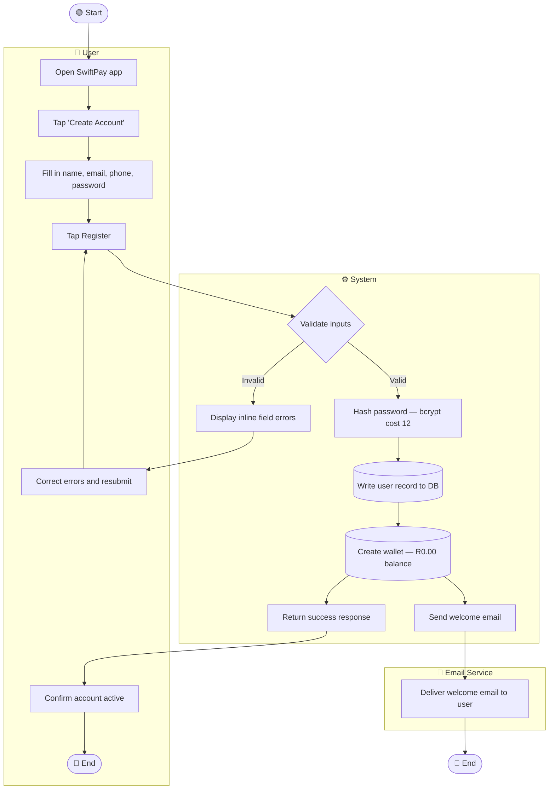
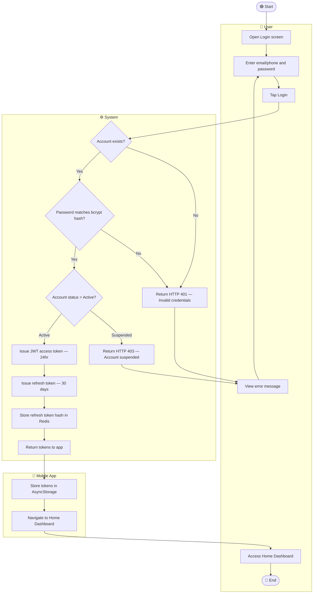
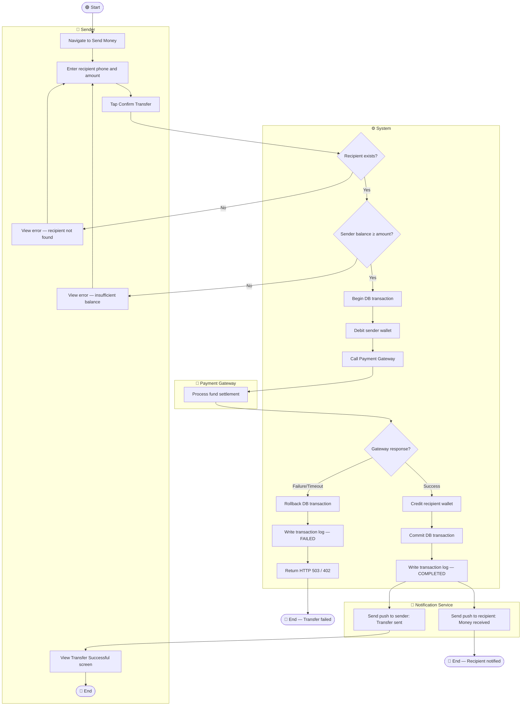
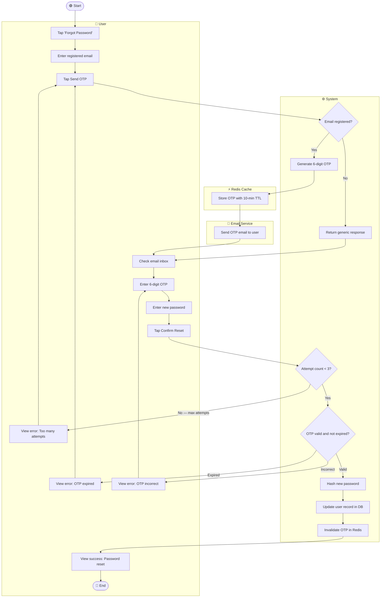
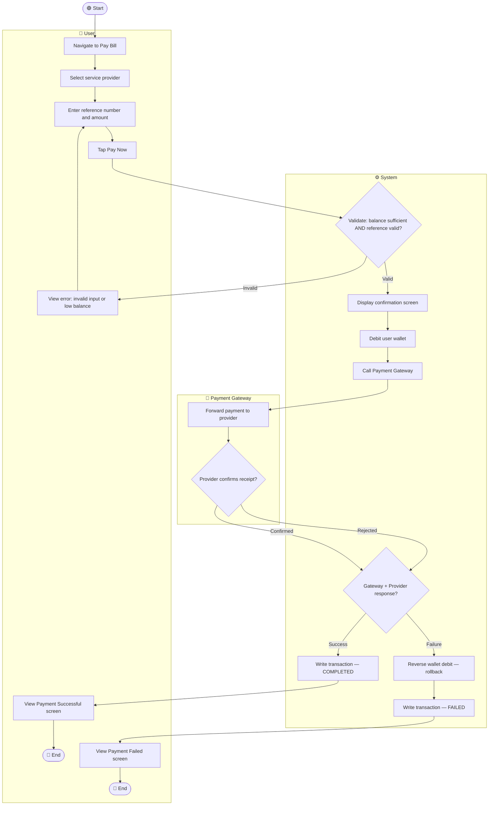
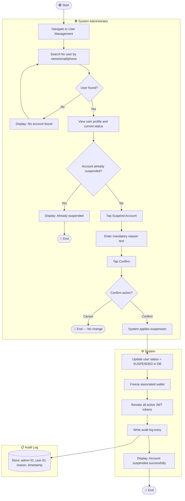
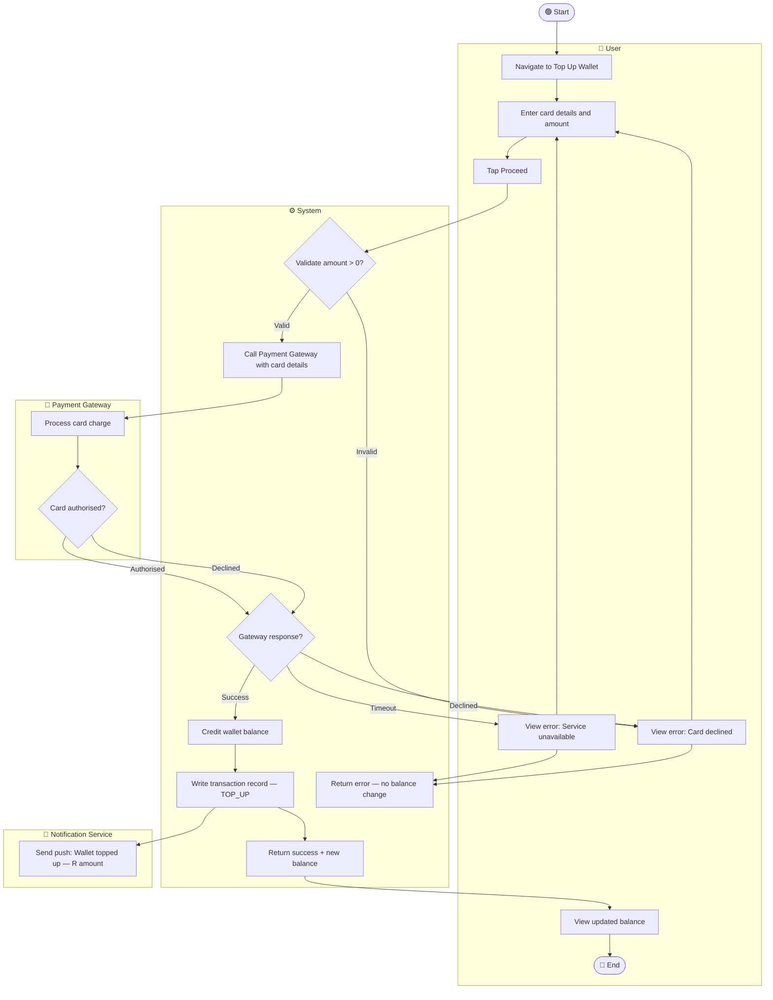
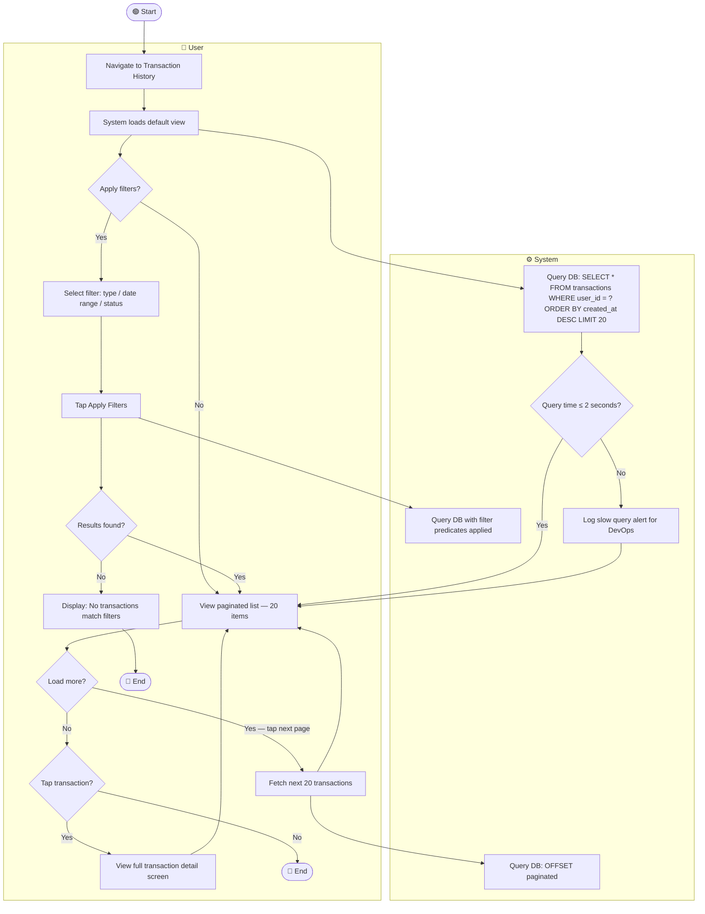

# ACTIVITY_DIAGRAMS.md — Activity Workflow Modeling
## SwiftPay Mobile Payment App

> **Assignment 8 | Activity Diagrams**
> Models 8 complex SwiftPay workflows using UML activity diagrams in Mermaid.
> Includes swimlanes, decision nodes, parallel actions, and start/end nodes.

---

## 1. User Registration Workflow

**Explanation:**
The parallel branches after wallet creation (`Send welcome email` and `Return success response`) ensure the user is not blocked waiting for email delivery. The system responds immediately while the email dispatches asynchronously — addressing the End User's need for fast registration (≤ 3 seconds, FR-01) while still fulfilling the Compliance Officer's requirement for onboarding communication.

| Element | Requirement |
|---|---|
| bcrypt hashing step | NFR-09 |
| Wallet auto-creation | FR-04 |
| Async email dispatch | NFR-05 (reliability) |
| Inline validation errors | NFR-01 (usability) |

---

## 2. Login and Authentication Workflow

**Explanation:**
The deliberate ambiguity of the HTTP 401 response (returned for both "account not found" and "wrong password") is a security design decision — it prevents user enumeration attacks. This workflow directly serves the End User's concern for secure access and the Compliance Officer's security baseline requirements.

| Element | Requirement |
|---|---|
| bcrypt comparison | NFR-09 |
| JWT issuance | FR-02 |
| Suspended account guard | FR-15 |
| Token storage in AsyncStorage | NFR-02 |

---

## 3. P2P Money Transfer Workflow

**Explanation:**
The parallel notification branches after a successful transfer (sender notification and recipient notification) ensure both parties are informed simultaneously without either waiting for the other. The atomic DB transaction wrapping debit + gateway + credit is the most critical path in the entire system — the rollback branch directly addresses the Compliance Officer's requirement for no partial transactions.

| Element | Requirement |
|---|---|
| Balance guard | FR-07 |
| Atomic DB transaction + rollback | FR-08 |
| Parallel push notifications | FR-09 |
| Gateway integration | FR-07 |

---

## 4. Password Reset via OTP Workflow

**Explanation:**
The generic response for unregistered emails prevents user enumeration — an attacker cannot determine whether an email is registered by testing the reset flow. The Redis TTL and attempt counter are parallel security controls that protect against both time-based and brute-force attacks.

| Element | Requirement |
|---|---|
| OTP generation + Redis TTL | FR-03 |
| 3-attempt limit | NFR-09 (brute force protection) |
| Generic response for unknown email | NFR-09 (no info leak) |
| bcrypt on new password | NFR-09 |

---

## 5. Bill Payment Workflow

**Explanation:**
The two-step flow (validation → confirmation screen → payment) gives the user a final chance to review before funds move — directly addressing the End User's pain point of accidental payments. The rollback on gateway failure mirrors the P2P transfer pattern for consistency.

| Element | Requirement |
|---|---|
| Balance guard | FR-11 |
| Confirmation screen | NFR-01 (usability) |
| Provider webhook confirmation | FR-10 |
| Rollback on failure | FR-08 |

---

## 6. Admin: Suspend User Account Workflow

**Explanation:**
The parallel actions of freezing the wallet and revoking JWT tokens happen together after the DB status update — ensuring the user cannot complete an in-flight transaction during the suspension window. The mandatory reason field and audit log write directly address the Compliance Officer's requirement for traceable admin actions.

| Element | Requirement |
|---|---|
| Status update | FR-15 |
| JWT revocation | NFR-02 |
| Wallet freeze | FR-15 (side effect) |
| Audit log write | FR-15, NFR-11 |

---

## 7. Top Up Wallet Workflow

**Explanation:**
The push notification after a successful top-up runs in parallel with returning the updated balance to the UI — consistent with the notification pattern used in P2P transfers, ensuring the user is always informed regardless of which screen they are on. This addresses the End User's need for real-time balance awareness.

| Element | Requirement |
|---|---|
| Gateway card processing | FR-06 |
| Balance credit on confirmation only | FR-06 (acceptance criteria) |
| Transaction record | FR-12 (history) |
| Push notification | FR-09 pattern |

---

## 8. View and Filter Transaction History Workflow

**Explanation:**
The slow query detection branch (> 2 seconds) does not block the user — the data still returns, but a DevOps alert is raised for investigation. This balances the End User's need for responsiveness (NFR-12) with the IT Engineer's need for observability. The pagination loop ensures large datasets never cause memory or performance issues on the mobile client.

| Element | Requirement |
|---|---|
| Default paginated load | FR-12 |
| Filter application | FR-13 |
| ≤ 2 second target | NFR-12 |
| Slow query alert | NFR-07 (observability) |

---

*SwiftPay — ACTIVITY_DIAGRAMS.md | Software Engineering Assignment 8*
