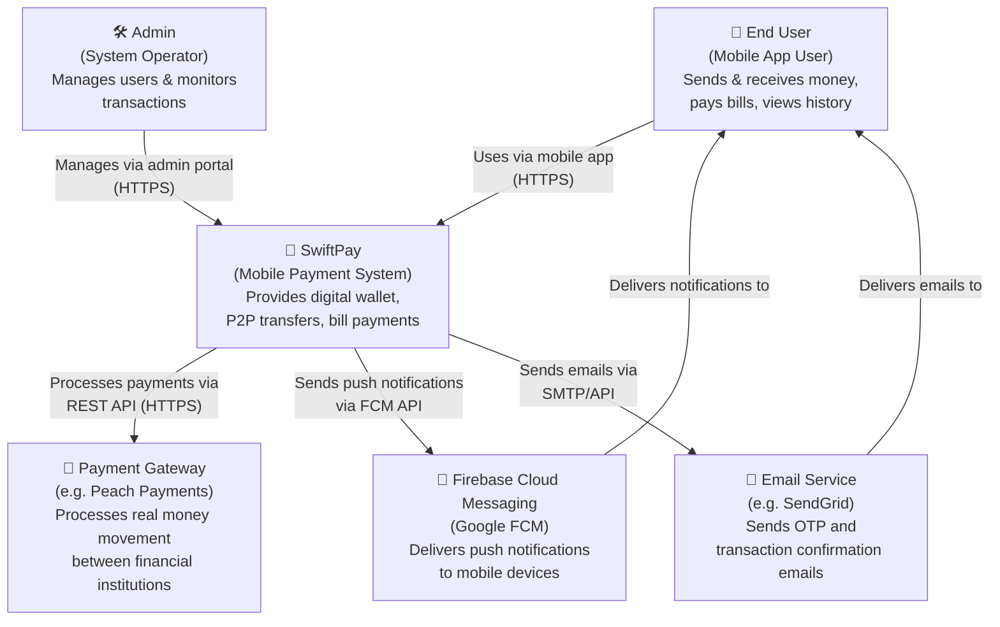
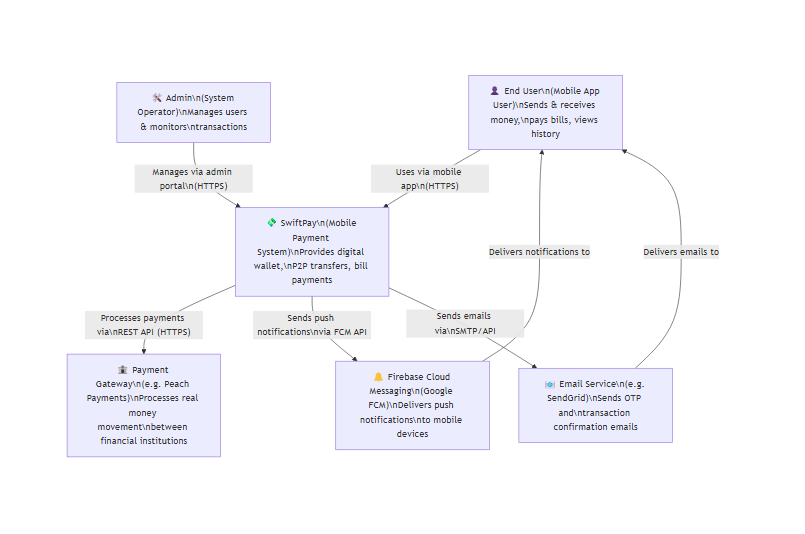
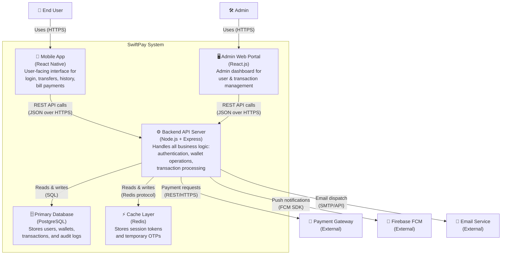
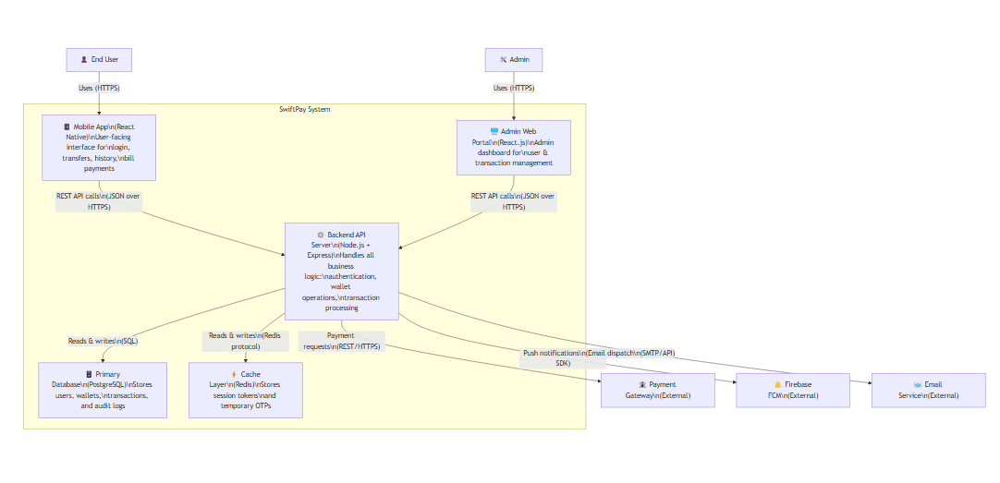
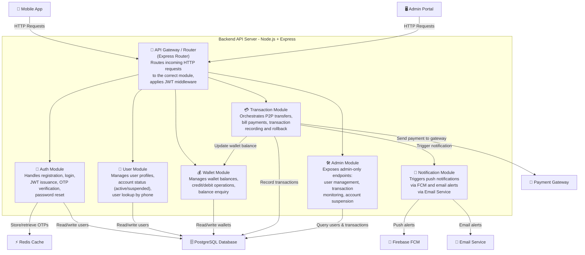
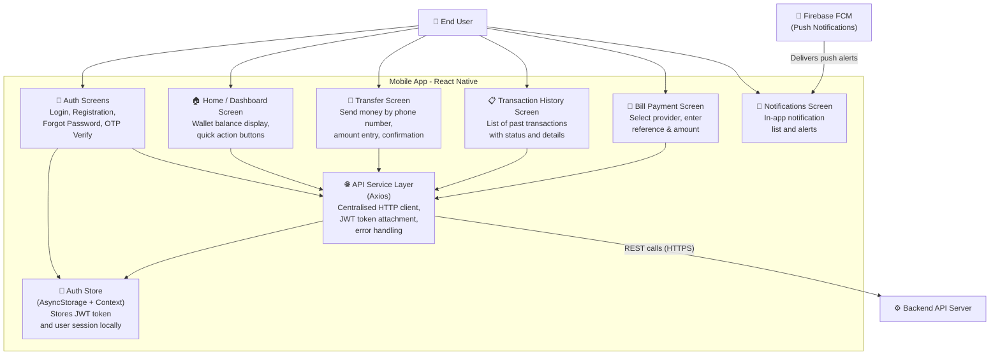
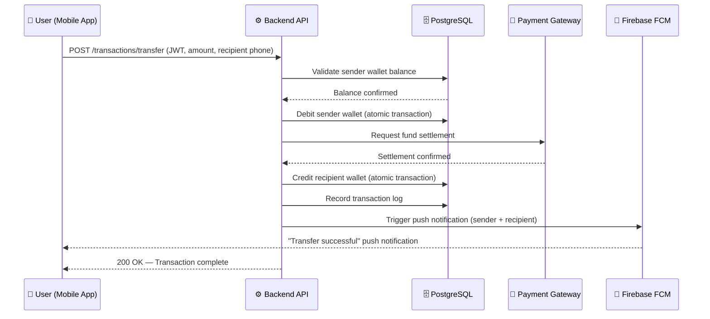
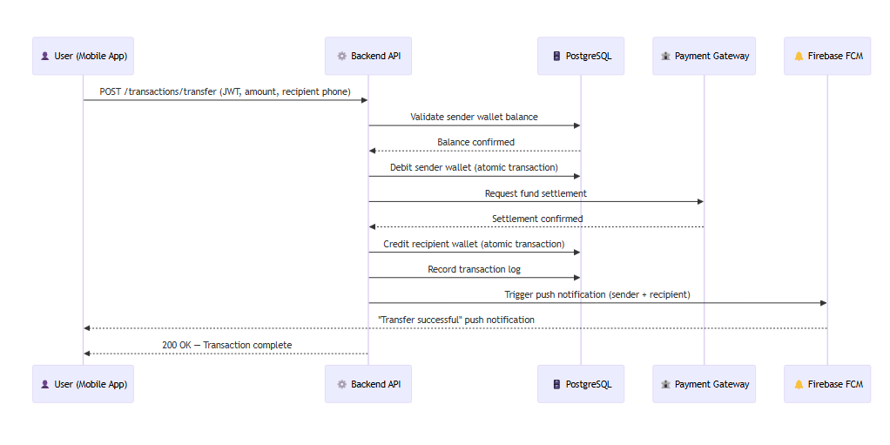

# ARCHITECTURE.md — SwiftPay Mobile Payment App

This document describes the software architecture of SwiftPay using the **C4 Model**, which organises diagrams into four levels of abstraction: **Context → Container → Component → Code**. Diagrams are written in **Mermaid**, a text-based diagramming language supported natively by GitHub.

> **C4 Model Quick Reference:**
> - **Level 1 – Context:** Who uses the system and what external systems does it interact with?
> - **Level 2 – Container:** What are the major deployable units (apps, databases, APIs)?
> - **Level 3 – Component:** What are the key building blocks inside each container?
> - **Level 4 – Code:** Class/module level detail (out of scope for this phase)

---
 * 
## Level 1 — System Context Diagram

> Shows SwiftPay as a black box and illustrates all external actors and systems that interact with it.

---

## Level 2 — Container Diagram

> Zooms into SwiftPay and shows the major containers (deployable units): the mobile app, backend API, database, and cache.

---

## Level 3 — Component Diagram (Backend API Server)

> Zooms into the Backend API Server container and shows its internal components (modules/services).

.png)
---

## Level 3 — Component Diagram (Mobile App)

> Zooms into the React Native Mobile App and shows its internal screens and service components.

.png)
---

## End-to-End Flow Summary

The diagram below illustrates a complete P2P money transfer from a user's perspective, end to end:

---

*SwiftPay — ARCHITECTURE.md | Software Engineering Assignment 3*
