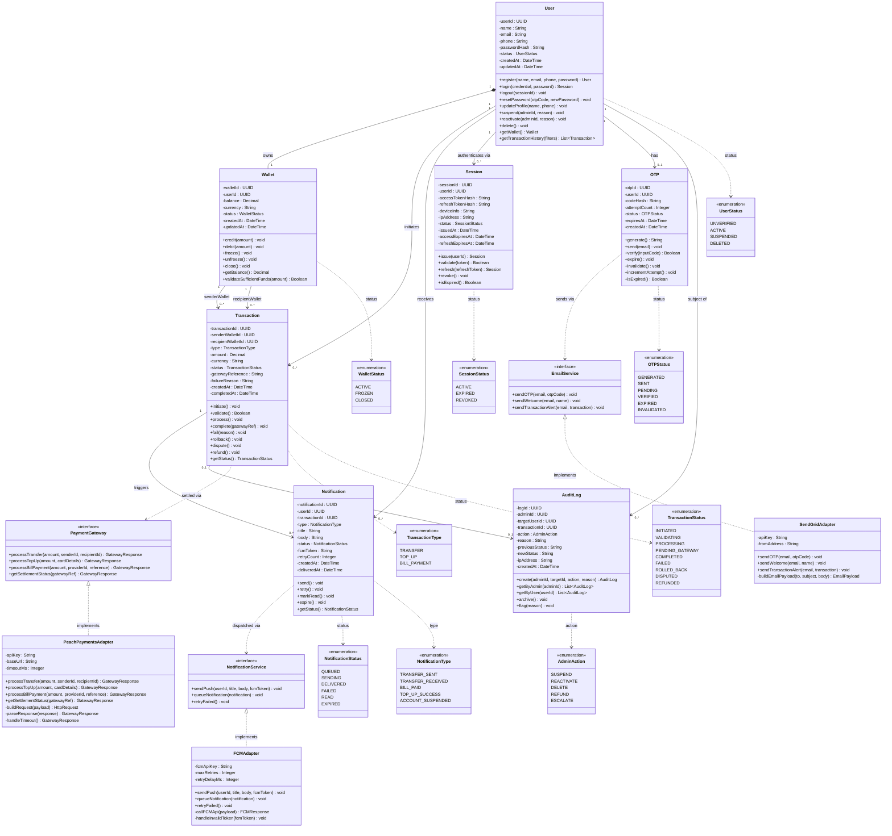

# CLASS_DIAGRAM.md — Class Diagram
## SwiftPay Mobile Payment App

> **Assignment 9 | Class Diagram in Mermaid.js**
> Full UML class diagram including attributes, methods, relationships, multiplicity, and design notes.

---

## Class Diagram

---

## Key Design Decisions

### 1. Composition vs. Association for User → Wallet
The `User` to `Wallet` relationship is modelled as **composition** (filled diamond) rather than association. This reflects the business rule that a Wallet cannot exist independently of a User — if the User is deleted, the Wallet is closed and archived. Every other relationship is a standard association because the referenced objects have independent lifecycles.

### 2. Interface + Adapter Pattern for External Services
`PaymentGateway`, `NotificationService`, and `EmailService` are modelled as **interfaces** with concrete adapter implementations (`PeachPaymentsAdapter`, `FCMAdapter`, `SendGridAdapter`). This design decision decouples the domain from specific third-party providers — if SwiftPay switches from Peach Payments to Stripe, only the adapter changes. The domain classes (`Transaction`, `Notification`, `OTP`) depend on the interface, never the concrete class. This maps directly to NFR-06 (maintainability).

### 3. Enumerations for All Status Fields
Every status field (`UserStatus`, `TransactionStatus`, etc.) is modelled as a named enumeration rather than a raw string. This prevents invalid state values at the application layer and maps directly to the state transition diagrams in Assignment 8 — every enumeration value corresponds to a named state in those diagrams.

### 4. Transaction as an Immutable Audit Record
`Transaction` has no `update()` method. Once created, transaction records can only move forward through states via specific methods (`complete()`, `fail()`, `rollback()`). This immutability is a deliberate design decision reflecting BR-07 (COMPLETED transactions cannot be modified) and the financial industry's requirement for tamper-proof ledgers.

### 5. AuditLog Separation from Transaction
`AuditLog` is a separate class from `Transaction` rather than a field on `User`. This separation means that administrative actions (suspend, delete, escalate) and financial actions (transfer, payment) are tracked in different tables with different retention and access control policies — matching NFR-11 (12-month audit retention) and the Compliance Officer's concerns from Assignment 4.

---

## Traceability to Prior Assignments

| Class / Relationship | Assignment 4 (FR/NFR) | Assignment 5 (UC) | Assignment 8 (State) |
|---|---|---|---|
| `User` + `UserStatus` | FR-01, FR-02, FR-15 | UC-01, UC-02, UC-10 | User Account state diagram |
| `Wallet` + `WalletStatus` | FR-04, FR-05, FR-06 | UC-04, UC-06 | Wallet state diagram |
| `Transaction` + `TransactionStatus` | FR-07, FR-08, FR-10 | UC-05, UC-07 | Transaction state diagram |
| `Notification` + `NotificationStatus` | FR-09 | UC-09 | Push Notification state diagram |
| `OTP` + `OTPStatus` | FR-03 | UC-03 | OTP state diagram |
| `Session` + `SessionStatus` | FR-02, NFR-02 | UC-02 | JWT Session state diagram |
| `AuditLog` + `AdminAction` | FR-15, NFR-11 | UC-10 | Admin Action state diagram |
| `PaymentGateway` interface | FR-07, FR-10 | UC-05, UC-07 | Transaction activity diagram |
| `NotificationService` interface | FR-09 | UC-09 | Notification state diagram |
| `EmailService` interface | FR-03 | UC-03 | OTP state diagram |

---

*SwiftPay — CLASS_DIAGRAM.md | Software Engineering Assignment 9*
