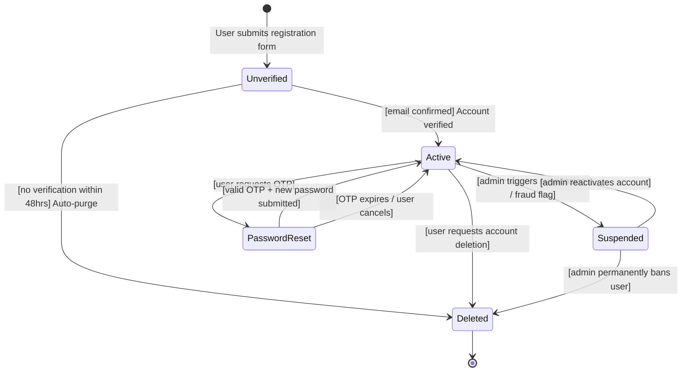
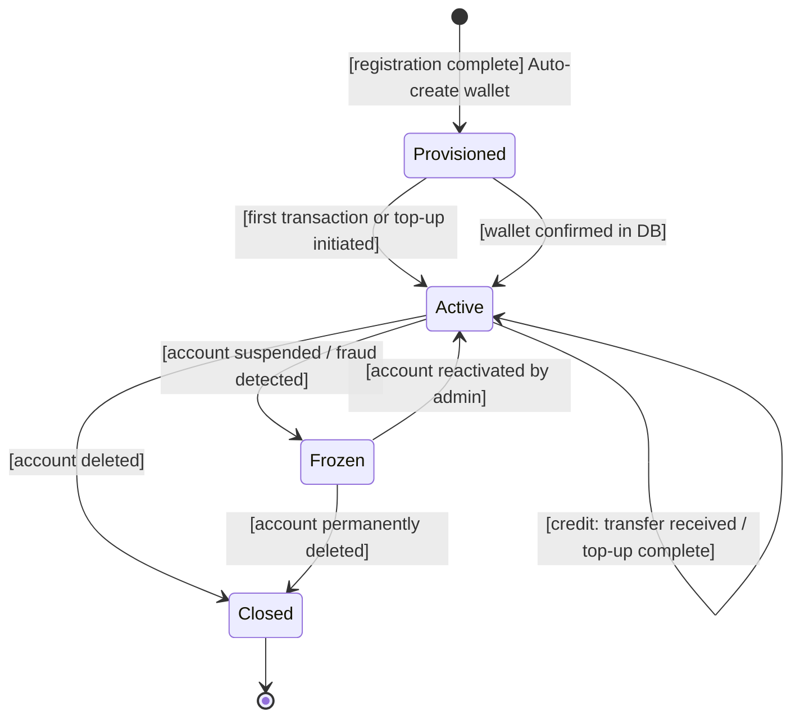
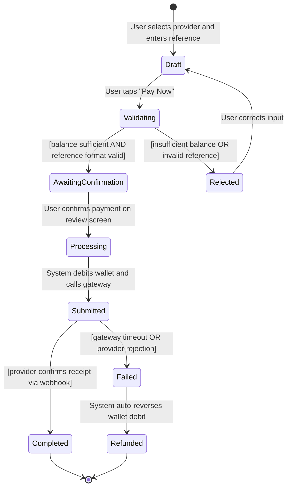

# STATE_DIAGRAMS.md — Object State Modeling
## SwiftPay Mobile Payment App

> **Assignment 8 | State Transition Diagrams**
> Models the lifecycle of 8 critical SwiftPay objects using UML state transition diagrams in Mermaid.
> Aligned with functional requirements (SRD.md) and use cases (USE_CASES.md).

---

## 1. User Account

**Key States & Transitions:**
- **Unverified** — account record exists but email not yet confirmed; user cannot log in
- **Active** — fully operational; user can send money, view balance, pay bills
- **PasswordReset** — temporary state while OTP is in flight; account remains accessible but password change is pending
- **Suspended** — login blocked; existing wallet funds frozen; admin action required to restore
- **Deleted** — terminal state; all PII scrubbed per POPIA compliance

**Mapping to Requirements:**
| Transition | Requirement |
|---|---|
| Unverified → Active | FR-01 (registration), FR-02 (login prerequisite) |
| Active → Suspended | FR-15 (admin suspend/reactivate) |
| Suspended → Active | FR-15 (reactivation) |
| Active → PasswordReset | FR-03 (OTP reset) |

---

## 2. Wallet

**Key States & Transitions:**
- **Provisioned** — wallet record created at R0.00; no transactions yet
- **Active** — normal operating state; debits and credits applied continuously
- **Frozen** — balance preserved but no transactions permitted; mirrors account suspension
- **Closed** — terminal state; balance reconciled and archived

**Mapping to Requirements:**
| Transition | Requirement |
|---|---|
| [*] → Provisioned | FR-04 (auto-provision wallet) |
| Active → Active (debit) | FR-07 (P2P transfer), FR-10 (bill payment) |
| Active → Active (credit) | FR-07 (receive transfer), FR-06 (top-up) |
| Active → Frozen | FR-15 (suspension side-effect) |
| Frozen → Active | FR-15 (reactivation side-effect) |

---

## 3. Transaction

```mermaid
stateDiagram-v2
    [*] --> Initiated : User confirms transfer / payment

    Initiated --> Validating : System begins pre-flight checks

    Validating --> Processing : [balance sufficient AND recipient found]
    Validating --> Failed : [insufficient balance OR recipient not found]

    Processing --> PendingGateway : Sender wallet debited; awaiting gateway

    PendingGateway --> Completed : [gateway confirms settlement]
    PendingGateway --> RolledBack : [gateway timeout OR decline]

    Completed --> Disputed : [user raises dispute within 30 days]
    Completed --> [*] : No dispute raised

    Disputed --> Resolved : [admin resolves dispute]
    Disputed --> Refunded : [admin approves refund]

    RolledBack --> [*]
    Failed --> [*]
    Resolved --> [*]
    Refunded --> [*]
```

**Key States & Transitions:**
- **Initiated** — user has confirmed the action; system begins processing
- **Validating** — pre-flight checks: balance, recipient existence, fraud rules
- **Processing** — debit applied atomically; gateway call in progress
- **PendingGateway** — funds debited locally; waiting for external settlement confirmation
- **Completed** — fully settled; both wallets updated; notifications sent
- **RolledBack** — gateway failed; debit reversed; no net change to any wallet
- **Failed** — validation failed; no funds moved
- **Disputed / Resolved / Refunded** — post-completion states for customer support flows

**Mapping to Requirements:**
| Transition | Requirement |
|---|---|
| Validating → Failed | FR-07 (insufficient balance), FR-11 (bill payment guard) |
| Processing → PendingGateway | FR-07 (atomic debit), FR-08 (atomicity) |
| PendingGateway → RolledBack | FR-08 (rollback on failure) |
| PendingGateway → Completed | FR-07 (successful transfer) |
| Completed → Disputed | UC-12 (resolve dispute) |

---

## 4. Push Notification

```mermaid
stateDiagram-v2
    [*] --> Queued : Transaction completed; notification triggered

    Queued --> Sending : FCM API call initiated

    Sending --> Delivered : [FCM confirms delivery to device]
    Sending --> Failed : [FCM returns error / device token invalid]
    Sending --> Retrying : [FCM timeout; retry attempt 1 or 2]

    Retrying --> Delivered : [retry succeeds]
    Retrying --> Failed : [max retries (3) exceeded]

    Delivered --> Read : [user opens notification]
    Delivered --> Expired : [notification not opened within 30 days]

    Read --> [*]
    Expired --> [*]
    Failed --> [*]
```

**Key States & Transitions:**
- **Queued** — notification payload created; waiting for FCM dispatch
- **Sending** — active FCM API call in flight
- **Retrying** — transient failure; automatic retry with exponential backoff
- **Delivered** — FCM confirmed device receipt
- **Failed** — permanent failure after max retries; transaction still valid
- **Read / Expired** — terminal states tracking user engagement

**Mapping to Requirements:**
| Transition | Requirement |
|---|---|
| [*] → Queued | FR-09 (trigger notification on transfer) |
| Sending → Delivered | FR-09 (delivery within 3 seconds) |
| Sending → Retrying | NFR-05 (reliability / retry logic) |
| Failed (graceful) | NFR-05 (transfer succeeds even if notification fails) |

---

## 5. Bill Payment

**Key States & Transitions:**
- **Draft** — user is filling in payment details; nothing committed yet
- **Validating** — balance and reference number checked before user sees confirmation
- **AwaitingConfirmation** — validated; waiting for explicit user confirmation
- **Processing** — wallet debited; gateway call in flight
- **Submitted** — gateway received the payment; awaiting provider webhook
- **Completed** — provider confirmed; transaction archived
- **Failed / Refunded** — gateway or provider error; debit reversed automatically

**Mapping to Requirements:**
| Transition | Requirement |
|---|---|
| Validating → Rejected | FR-11 (block if insufficient balance) |
| Processing → Submitted | FR-10 (bill payment processing) |
| Submitted → Failed → Refunded | FR-08 (atomicity / rollback) |
| Submitted → Completed | FR-10 (provider confirmation) |

---

## 6. User Session (JWT Token)

```mermaid
stateDiagram-v2
    [*] --> Issued : Successful login; JWT + refresh token generated

    Issued --> Active : Token attached to API request

    Active --> Active : [token valid; request processed]
    Active --> Expired : [token age > 24 hours]
    Active --> Revoked : [user logs out OR account suspended]

    Expired --> Refreshed : [valid refresh token submitted]
    Expired --> Terminated : [refresh token also expired OR not submitted]

    Refreshed --> Active : New access token issued

    Revoked --> [*]
    Terminated --> [*]
```

**Key States & Transitions:**
- **Issued** — both access token (24hr) and refresh token (30 days) generated on login
- **Active** — token validated by JWT middleware on each request
- **Expired** — access token TTL exceeded; refresh flow required
- **Refreshed** — new access token issued without re-login
- **Revoked** — immediate invalidation on logout or account suspension
- **Terminated** — session fully ended; user must log in again

**Mapping to Requirements:**
| Transition | Requirement |
|---|---|
| [*] → Issued | FR-02 (JWT issuance on login) |
| Active → Revoked | FR-15 (suspension immediately revokes session) |
| Expired → Refreshed | FR-02 (refresh token flow) |
| Active → Active | NFR-02 (JWT middleware on every request) |

---

## 7. OTP (One-Time Password)

```mermaid
stateDiagram-v2
    [*] --> Generated : User requests password reset

    Generated --> Sent : OTP dispatched via email service

    Sent --> Pending : OTP delivered to user's inbox

    Pending --> Verified : [user enters correct OTP within 10 minutes]
    Pending --> Expired : [10-minute TTL exceeded in Redis]
    Pending --> Invalidated : [3 incorrect attempts made]

    Verified --> [*] : Password updated; OTP removed from Redis
    Expired --> [*] : OTP purged from Redis
    Invalidated --> [*] : OTP purged; user must request new one
```

**Key States & Transitions:**
- **Generated** — 6-digit code created and stored in Redis with 10-minute TTL
- **Sent** — dispatched via Email Service (SendGrid)
- **Pending** — awaiting user input; Redis TTL countdown active
- **Verified** — correct code submitted within window; password update proceeds
- **Expired** — TTL exceeded; Redis auto-purges the key
- **Invalidated** — brute-force protection; 3 wrong attempts kills the OTP

**Mapping to Requirements:**
| Transition | Requirement |
|---|---|
| [*] → Generated | FR-03 (password reset initiation) |
| Pending → Verified | FR-03 (valid OTP → password update) |
| Pending → Expired | FR-03 (10-minute validity window) |
| Pending → Invalidated | NFR-09 (security — brute force protection) |

---

## 8. Admin Action (Audit Log Entry)

```mermaid
stateDiagram-v2
    [*] --> Initiated : Admin selects action (suspend / reactivate / refund)

    Initiated --> PendingConfirmation : System displays action summary and reason field

    PendingConfirmation --> Executing : [admin enters reason AND confirms]
    PendingConfirmation --> Cancelled : [admin dismisses / cancels]

    Executing --> Logged : System applies change AND writes audit log entry

    Logged --> UnderReview : [compliance officer flags entry for review]
    Logged --> Archived : [entry older than 90 days; moved to cold storage]
    Logged --> [*] : Normal completion

    UnderReview --> Escalated : [compliance officer escalates to senior review]
    UnderReview --> Cleared : [review finds no issue]

    Escalated --> [*]
    Cleared --> [*]
    Cancelled --> [*]
    Archived --> [*]
```

**Key States & Transitions:**
- **Initiated** — admin has selected an action from the dashboard
- **PendingConfirmation** — two-step confirmation prevents accidental actions
- **Executing** — system applies the change (DB update) atomically with log write
- **Logged** — immutable audit trail entry created with admin ID, reason, timestamp
- **UnderReview / Escalated / Cleared** — compliance workflow for sensitive actions
- **Archived** — long-term storage per POPIA 12-month retention requirement

**Mapping to Requirements:**
| Transition | Requirement |
|---|---|
| Executing → Logged | FR-15 (audit log on every admin action) |
| Logged → Archived | NFR-11 (12-month audit trail retention) |
| PendingConfirmation → Cancelled | UC-10 (admin cancels action) |
| Logged → UnderReview | UC-12 (compliance monitoring) |

---

*SwiftPay — STATE_DIAGRAMS.md | Software Engineering Assignment 8*
