# USE_CASES.md — Use Case Modeling
## SwiftPay Mobile Payment App

> **Assignment 5 | Use Case Diagrams & Specifications**
> Builds directly on stakeholders (Assignment 4) and functional requirements (SRD.md)

---

## 1. Use Case Diagram

```mermaid
graph TD
    %% Actors
    EU("👤 End User")
    RU("📲 Recipient User")
    ADM("🛠️ System Administrator")
    CSA("🎧 Customer Support Agent")
    PGW("🏦 Payment Gateway")
    FCM("🔔 Notification Service\n(Firebase FCM)")
    CO("🔒 Compliance Officer")

    %% Use Cases
    UC1["UC-01\nRegister Account"]
    UC2["UC-02\nLogin / Authenticate"]
    UC3["UC-03\nReset Password"]
    UC4["UC-04\nView Wallet Balance"]
    UC5["UC-05\nSend Money (P2P Transfer)"]
    UC6["UC-06\nTop Up Wallet"]
    UC7["UC-07\nPay Bill"]
    UC8["UC-08\nView Transaction History"]
    UC9["UC-09\nReceive Push Notification"]
    UC10["UC-10\nManage Users (Suspend/Reactivate)"]
    UC11["UC-11\nMonitor Transactions"]
    UC12["UC-12\nResolve Transaction Dispute"]

    %% Included Use Cases (dependencies)
    INC1["«include»\nValidate Wallet Balance"]
    INC2["«include»\nProcess Payment via Gateway"]
    INC3["«include»\nSend Notification"]
    INC4["«include»\nVerify JWT Token"]

    %% End User associations
    EU --> UC1
    EU --> UC2
    EU --> UC3
    EU --> UC4
    EU --> UC5
    EU --> UC6
    EU --> UC7
    EU --> UC8

    %% Recipient User associations
    RU --> UC9

    %% Admin associations
    ADM --> UC10
    ADM --> UC11

    %% Customer Support associations
    CSA --> UC12
    CSA --> UC11

    %% Compliance Officer
    CO --> UC11
    CO --> UC10

    %% Include relationships
    UC5 -.->|«include»| INC1
    UC7 -.->|«include»| INC1
    UC5 -.->|«include»| INC2
    UC6 -.->|«include»| INC2
    UC7 -.->|«include»| INC2
    UC5 -.->|«include»| INC3
    UC7 -.->|«include»| INC3
    UC2 -.->|«include»| INC4
    UC4 -.->|«include»| INC4
    UC8 -.->|«include»| INC4

    %% External system interactions
    INC2 --> PGW
    INC3 --> FCM
```

---

## 2. Diagram Explanation

### 2.1 Key Actors and Their Roles

| Actor | Type | Role |
|---|---|---|
| **End User** | Primary Actor | The registered SwiftPay user who sends money, tops up wallet, pays bills, and views history |
| **Recipient User** | Primary Actor | A registered user who receives funds and push notifications from another user's transfer |
| **System Administrator** | Primary Actor | Internal operator who manages user accounts, suspends/reactivates users, and monitors system-wide transactions |
| **Customer Support Agent** | Primary Actor | Handles user complaints, views transaction history, and resolves disputes on behalf of users |
| **Compliance Officer** | Primary Actor | Monitors transactions for fraud/policy violations and coordinates account suspensions |
| **Payment Gateway** | External System | Processes real fund movement for top-ups and bill payments (e.g. Peach Payments) |
| **Notification Service (FCM)** | External System | Delivers push notifications to mobile devices upon transaction events |

### 2.2 Key Relationships

- **«include»** relationships model mandatory sub-steps. For example, UC-05 (Send Money) *always* includes `Validate Wallet Balance` and `Process Payment via Gateway` — these are not optional.
- **«include» Verify JWT Token** is shared across all authenticated use cases (UC-02, UC-04, UC-08), reflecting NFR-02's requirement that all endpoints require JWT authentication.
- **Recipient User** participates only in UC-09 (Receive Notification), reflecting that the recipient is a passive actor — they don't initiate the transfer but are a stakeholder in its outcome.
- **Admin and Compliance Officer** both associate with UC-10 and UC-11, reflecting shared oversight responsibilities with different permission scopes.

### 2.3 Alignment with Stakeholder Concerns (Assignment 4)

| Stakeholder | Concern (from STAKEHOLDERS.md) | Addressed by Use Case |
|---|---|---|
| End User (Sender) | Fast, reliable transfers | UC-05 (Send Money) with included wallet validation and gateway processing |
| End User (Recipient) | Instant notification of received funds | UC-09 (Receive Notification) triggered by UC-05 |
| System Administrator | Real-time visibility; ability to suspend bad actors | UC-10 (Manage Users), UC-11 (Monitor Transactions) |
| Compliance Officer | Audit trails; fraud detection | UC-11 with read access across all transactions |
| Customer Support Agent | Access to history; dispute resolution | UC-12 (Resolve Dispute), UC-11 (Monitor) |
| Payment Gateway | Reliable integration; no duplicate requests | UC-05, UC-06, UC-07 all «include» INC2 (Process Payment) |

---

## 3. Use Case Specifications

---

### UC-01: Register Account

| Field | Detail |
|---|---|
| **Use Case ID** | UC-01 |
| **Use Case Name** | Register Account |
| **Actor(s)** | End User |
| **Linked FR** | FR-01, FR-04 |
| **Description** | A new user creates a SwiftPay account by providing personal details. The system validates inputs, creates a user record, and automatically provisions a ZAR wallet. |
| **Preconditions** | User has not previously registered with the provided email or phone number. Device has an active internet connection. |
| **Postconditions** | A verified user account exists in the database. A ZAR wallet with R0.00 balance is linked to the account. User is redirected to the login screen. |

**Basic Flow:**
1. User opens the SwiftPay app and selects "Create Account."
2. User enters full name, email address, South African mobile number, and a password (min 8 characters).
3. User submits the registration form.
4. System validates all fields (format, uniqueness of email/phone).
5. System hashes the password using bcrypt (cost factor 12).
6. System creates a user record and a linked wallet record in the database.
7. System sends a welcome email via the Email Service.
8. System displays a success message and navigates to the Login screen.

**Alternative Flows:**

| Step | Condition | System Response |
|---|---|---|
| 4a | Email already registered | Display: "This email is already in use. Please log in or reset your password." Registration halted. |
| 4b | Phone number already registered | Display: "This phone number is already linked to an account." Registration halted. |
| 4c | Password under 8 characters | Display: "Password must be at least 8 characters." Form not submitted. |
| 7a | Email service unavailable | Registration still succeeds; welcome email queued for retry. User proceeds normally. |

---

### UC-02: Login / Authenticate

| Field | Detail |
|---|---|
| **Use Case ID** | UC-02 |
| **Use Case Name** | Login / Authenticate |
| **Actor(s)** | End User |
| **Linked FR** | FR-02 |
| **Description** | A registered user authenticates with email/phone and password to receive a JWT access token and gain access to the app. |0
| **Preconditions** | User has a registered and active (non-suspended) SwiftPay account. |
| **Postconditions** | User receives a JWT access token (24hr) and refresh token (30 days). User is navigated to the Home Dashboard. |

**Basic Flow:**
1. User enters registered email/phone and password on the Login screen.
2. User taps "Login."
3. System validates credentials against the stored bcrypt hash.
4. System generates a JWT access token and a refresh token.
5. Tokens are securely stored in the device's AsyncStorage.
6. System navigates user to the Home Dashboard.

**Alternative Flows:**

| Step | Condition | System Response |
|---|---|---|
| 3a | Incorrect password | Return HTTP 401: "Invalid credentials. Please try again." No token issued. |
| 3b | Account suspended | Return HTTP 403: "Your account has been suspended. Please contact support." |
| 3c | Account not found | Return HTTP 401: "Invalid credentials." (Deliberately vague for security.) |

---

### UC-03: Reset Password

| Field | Detail |
|---|---|
| **Use Case ID** | UC-03 |
| **Use Case Name** | Reset Password |
| **Actor(s)** | End User |
| **Linked FR** | FR-03 |
| **Description** | A user who has forgotten their password requests a 6-digit OTP via email to reset it. |
| **Preconditions** | User has a registered account. User has access to their registered email inbox. |
| **Postconditions** | User's password is updated to the new value (hashed). Previous OTP is invalidated. |

**Basic Flow:**
1. User taps "Forgot Password" on the Login screen.
2. User enters their registered email address.
3. System validates the email exists in the database.
4. System generates a 6-digit OTP, stores it in Redis with a 10-minute TTL, and sends it via Email Service.
5. User enters the OTP and a new password.
6. System validates the OTP (not expired, matches stored value).
7. System hashes the new password and updates the user record.
8. System invalidates the OTP in Redis.
9. System displays: "Password reset successfully. Please log in."

**Alternative Flows:**

| Step | Condition | System Response |
|---|---|---|
| 3a | Email not found | Display: "If this email is registered, you will receive an OTP." (No info leak.) |
| 6a | OTP expired (> 10 min) | Display: "OTP has expired. Please request a new one." |
| 6b | OTP incorrect | Display: "Incorrect OTP. Please try again." Allow up to 3 attempts. |
| 6c | 3 failed OTP attempts | Invalidate OTP and display: "Too many attempts. Please request a new OTP." |

---

### UC-05: Send Money (P2P Transfer)

| Field | Detail |
|---|---|
| **Use Case ID** | UC-05 |
| **Use Case Name** | Send Money (P2P Transfer) |
| **Actor(s)** | End User (Sender), Recipient User (passive), Payment Gateway, Notification Service |
| **Linked FR** | FR-07, FR-08, FR-09 |
| **Description** | An authenticated user transfers funds from their wallet to another registered SwiftPay user by entering the recipient's phone number and an amount. |
| **Preconditions** | Sender is authenticated (valid JWT). Sender's wallet balance ≥ transfer amount. Recipient is a registered SwiftPay user. |
| **Postconditions** | Sender's balance is debited. Recipient's balance is credited. Transaction record exists in the database. Both parties receive push notifications. |

**Basic Flow:**
1. Authenticated user navigates to "Send Money."
2. User enters recipient's phone number and transfer amount.
3. User taps "Confirm Transfer."
4. System validates recipient phone number exists in the system.
5. System checks sender wallet balance ≥ amount.
6. System begins an atomic database transaction: debit sender wallet.
7. System calls Payment Gateway to settle funds.
8. Gateway confirms settlement.
9. System credits recipient wallet within the same atomic transaction.
10. System commits the transaction and writes a transaction log record.
11. System triggers push notifications to both sender and recipient via FCM.
12. System displays "Transfer Successful" to sender.

**Alternative Flows:**

| Step | Condition | System Response |
|---|---|---|
| 4a | Recipient phone not found | Display: "No SwiftPay account found for this number." Transfer cancelled. |
| 5a | Insufficient balance | Display: "Insufficient funds. Your balance is R[X]. You need R[Y]." Transfer cancelled. |
| 7a | Gateway timeout (> 10s) | Rollback debit. Display: "Transfer failed. Please try again." No funds moved. |
| 8a | Gateway declines | Rollback debit. Log failed transaction. Display: "Payment declined by provider." |
| 11a | FCM unavailable | Transfer still succeeds; notification queued for retry. |

---

### UC-06: Top Up Wallet

| Field | Detail |
|---|---|
| **Use Case ID** | UC-06 |
| **Use Case Name** | Top Up Wallet |
| **Actor(s)** | End User, Payment Gateway |
| **Linked FR** | FR-06 |
| **Description** | An authenticated user adds funds to their SwiftPay wallet using a debit or credit card processed by the Payment Gateway. |
| **Preconditions** | User is authenticated. User has a valid debit/credit card. |
| **Postconditions** | Wallet balance is increased by the top-up amount. Transaction record created. |

**Basic Flow:**
1. User navigates to "Top Up Wallet."
2. User enters card details and desired top-up amount.
3. User taps "Proceed."
4. System sends payment request to Payment Gateway.
5. Gateway processes card charge and confirms success.
6. System credits user wallet with the top-up amount.
7. System creates a transaction record (type: TOP_UP).
8. System displays updated balance and success message.

**Alternative Flows:**

| Step | Condition | System Response |
|---|---|---|
| 5a | Card declined | Display: "Card payment failed. Please check your card details or try another card." Balance unchanged. |
| 5b | Gateway timeout | Display: "Payment service unavailable. Please try again." Balance unchanged. |

---

### UC-07: Pay Bill

| Field | Detail |
|---|---|
| **Use Case ID** | UC-07 |
| **Use Case Name** | Pay Bill |
| **Actor(s)** | End User, Payment Gateway |
| **Linked FR** | FR-10, FR-11 |
| **Description** | An authenticated user pays a registered service provider (electricity, water, airtime) by selecting the provider, entering a reference number, and specifying an amount. |
| **Preconditions** | User is authenticated. User wallet balance ≥ payment amount. Service provider is registered in the system. |
| **Postconditions** | User wallet is debited. Provider receives payment confirmation. Transaction record created. |

**Basic Flow:**
1. User navigates to "Pay Bill."
2. User selects service provider from the list.
3. User enters reference number and payment amount.
4. User taps "Pay Now."
5. System validates wallet balance ≥ amount.
6. System debits user wallet.
7. System sends payment request to Payment Gateway.
8. Gateway forwards payment to provider and confirms.
9. System records the transaction (type: BILL_PAYMENT).
10. System displays: "Payment successful."

**Alternative Flows:**

| Step | Condition | System Response |
|---|---|---|
| 5a | Insufficient balance | Display shortfall amount: "You need R[X] more to complete this payment." Halt. |
| 8a | Provider reference invalid | Rollback debit. Display: "Invalid reference number. Please check and retry." |
| 8b | Gateway failure | Rollback debit. Display: "Service temporarily unavailable." |

---

### UC-08: View Transaction History

| Field | Detail |
|---|---|
| **Use Case ID** | UC-08 |
| **Use Case Name** | View Transaction History |
| **Actor(s)** | End User, Customer Support Agent |
| **Linked FR** | FR-12, FR-13 |
| **Description** | An authenticated user (or authorised support agent) views a paginated, filterable list of all past transactions. |
| **Preconditions** | User or agent is authenticated with appropriate role. |
| **Postconditions** | Transaction list is displayed. No data is modified. |

**Basic Flow:**
1. User navigates to "Transaction History."
2. System retrieves the 20 most recent transactions for the user, sorted by date descending.
3. System displays each entry with: type, amount, counterparty, status, timestamp.
4. User optionally applies filters (date range, type, status).
5. System returns filtered results within 2 seconds.
6. User taps any entry to view full transaction details.

**Alternative Flows:**

| Step | Condition | System Response |
|---|---|---|
| 2a | No transactions exist | Display: "No transactions yet. Start by sending money or topping up." |
| 5a | Filter returns no results | Display: "No transactions match your filters." |
| 5b | Database query exceeds 3s | Display loading spinner; log slow query for DevOps review. |

---

### UC-10: Manage Users (Suspend / Reactivate)

| Field | Detail |
|---|---|
| **Use Case ID** | UC-10 |
| **Use Case Name** | Manage Users |
| **Actor(s)** | System Administrator, Compliance Officer |
| **Linked FR** | FR-15 |
| **Description** | An admin or compliance officer suspends or reactivates a user account, immediately preventing or restoring their access. |
| **Preconditions** | Actor is authenticated with ADMIN or COMPLIANCE role. Target user account exists. |
| **Postconditions** | User account status is updated to SUSPENDED or ACTIVE in the database. |

**Basic Flow:**
1. Admin navigates to the Admin Dashboard → User Management.
2. Admin searches for the target user by name, email, or phone.
3. System displays user profile and current account status.
4. Admin selects "Suspend Account" or "Reactivate Account."
5. System prompts for a reason (mandatory text field).
6. Admin confirms the action.
7. System updates account status in the database.
8. System logs the action (admin ID, timestamp, reason) to the audit trail.
9. System displays: "Account status updated."

**Alternative Flows:**

| Step | Condition | System Response |
|---|---|---|
| 2a | User not found | Display: "No account found matching your search." |
| 4a | Suspending already-suspended account | Display: "This account is already suspended." No duplicate action taken. |
| 6a | Admin cancels confirmation | No change made. Return to User Management screen. |

---

*SwiftPay — USE_CASES.md | Software Engineering Assignment 5*
